# Biomedical Concept Extraction — Pipeline Diagram

```mermaid
flowchart TD
    classDef llm       fill:#ff9f43,stroke:#e67e22,color:#000,font-weight:bold
    classDef api       fill:#74b9ff,stroke:#0984e3,color:#000,font-weight:bold
    classDef local     fill:#7c6ee3,stroke:#6c5ce7,color:#fff,font-weight:bold
    classDef proc      fill:#dfe6e9,stroke:#95a5a6,color:#000
    classDef store     fill:#55efc4,stroke:#00b894,color:#000,font-weight:bold
    classDef decide    fill:#ffeaa7,stroke:#f9ca24,color:#000

    FILE[("udn_participates.csv")]:::store

    subgraph INIT_SG ["Setup"]
        S1["Load + clean dataset\npd.read_csv · dropna · column subset"]:::proc
        S2["Build row contexts\nrow_id · text · slice to MAX_ROWS_TO_RUN"]:::proc
        S3["Load extraction spec\ndocs/definitions_biomedical-concept-extraction.md"]:::proc
        S4["Assemble LLM instructions\nspec + allowed categories + JSON output schema"]:::proc
        S1 --> S2 --> S3 --> S4
    end

    subgraph EXTRACT_SG ["Step 1 — LLM Extraction   (per row)"]
        E1["LLM Call — Term Extraction\nModel: gpt-4.1-mini\nInput: clinical text row\nOutput: extracted_terms list\nterm · category · evidence_quote · confidence"]:::llm
        E2{"JSON\nparsed?"}:::decide
        E3["LLM Call — Retry\ntemp=0.3 · append JSON-only reminder\nup to MAX_PARSE_RETRIES = 2"]:::llm
        E4["Store row result\nparse_success · validation_errors · raw_output"]:::proc
        E1 --> E2
        E2 -- No --> E3 --> E2
        E2 -- Yes --> E4
    end

    FLAT["Flatten to terms_df\none row per extracted term"]:::proc

    subgraph NORM_SG ["Step 2 — CURIE Normalization   (per unique term)"]
        N1["Qualifier stripping\nQuery original term AND stripped core concept\nexample: absence-of-X also queries X\nbilateral-X also queries X"]:::proc
        N2["API Call — SRI Name Resolution\nname-resolution-sri.renci.org/lookup\nOntologies: HP · MONDO · UMLS · NCIT · OMIM · ORPHANET\nReturns: CURIE · label · NR score · synonyms\nResults disk-cached by query hash"]:::api
        N3["API Call — SapBERT\nsap-qdrant.apps.renci.org/annotate\nEmbedding-based concept retrieval\nReturns: top-25 matches · score · name · CURIE\nResults disk-cached by query hash"]:::api
        N4["Collect + lowercase all strings\nextracted terms · NR labels · NR synonyms"]:::proc
        N5["Local Model — BioBERT\ndmis-lab/biobert-base-cased-v1.2\nBatch embed all unique lowercase strings\nOutput: N x 768 embedding matrix"]:::local
        N6["Score candidates\nBioBERT: cosine(term, label+synonyms) → max\nSapBERT: score looked up by CURIE\nBest match = highest single cosine score\nTiebreaker = sum of both scores\nTag: winning_model per best candidate"]:::proc
        N1 --> N2 --> N3 --> N4 --> N5 --> N6
    end

    subgraph REVIEW_SG ["Step 3 — LLM Semantic Review   (per term)"]
        R0{"Best cosine\n>= 0.99?"}:::decide
        R_SKIP["Mark: llm_review_quality = skip"]:::proc
        R2["LLM Call — Semantic Review\nModel: gpt-4.1-mini\nInput: original term + top-8 NR candidates with scores\nOutput: recommended_curie · recommended_label\nquality: good / partial / none\nreasoning · suggested_query"]:::llm
        R3{"quality = none or partial\nAND suggested_query present?"}:::decide
        R4["API Call — Second-pass NR + SapBERT\nRe-query with LLM-suggested term\nexample: visual tracking\nfor absence of visual tracking\nDisk-cached"]:::api
        R5["Local Model — BioBERT\nEmbed new candidate strings\nfrom second-pass results"]:::local
        R6["Re-score against original term\nusing same cosine scoring logic"]:::proc
        R7["LLM Call — Second-pass Review\nModel: gpt-4.1-mini\nReview re-scored second-pass candidates"]:::llm
        R8["Update result if\nsecond-pass quality = good or partial\nprefix reasoning with second-pass note"]:::proc
        R0 -- Yes --> R_SKIP
        R0 -- No --> R2
        R2 --> R3
        R3 -- "No — store LLM result as-is" --> R_SKIP
        R3 -- Yes --> R4 --> R5 --> R6 --> R7 --> R8
    end

    FLAGS["Step 4 — Review Flags\nneeds_human_review = True if any:\n→ no CURIE found\n→ extraction confidence = Low\n→ best cosine below 0.70\n→ llm_review_quality: none · partial · parse_failed · review_failed"]:::proc

    subgraph OUT_SG ["Step 5 — Merge + Export"]
        O1["Merge term-level results back to source rows\nBuild extracted_terms_json per source record"]:::proc
        O2[("concept_extraction_TIMESTAMP.xlsx\nterm_level · source_level · run_metadata")]:::store
        O1 --> O2
    end

    subgraph LEGEND_SG ["Legend"]
        direction LR
        LG1["LLM Call"]:::llm
        LG2["REST API Call"]:::api
        LG3["Local Model"]:::local
        LG4["Code / Processing"]:::proc
        LG5["Data / File"]:::store
        LG6{"Decision"}:::decide
    end

    FILE --> S1
    S4 --> E1
    E4 --> FLAT
    FLAT --> N1
    N6 --> R0
    R_SKIP --> FLAGS
    R8 --> FLAGS
    FLAGS --> O1
```

## Color key

| Color | Type | Examples in this pipeline |
|---|---|---|
| Orange | LLM Call | Term extraction, semantic review, second-pass review |
| Blue | REST API Call | SRI Name Resolution, SapBERT |
| Purple | Local Model | BioBERT (runs twice if second-pass triggers) |
| Gray | Code / Processing | Qualifier stripping, cosine scoring, flattening, flagging |
| Green | Data / File | Input CSV, output Excel workbook |
| Yellow | Decision | JSON parse check, cosine threshold, second-pass trigger |

## Notes

- The retry loop in Step 1 is the only cycle. A failed parse at `temperature=0` retries at `temperature=0.3` with an explicit JSON-only reminder, since deterministic output cannot self-correct.
- NR and SapBERT results are disk-cached by query hash. Rerunning after a partial failure does not re-hit the APIs for previously queried terms.
- BioBERT runs in a single batch across all unique strings (terms + all NR labels + all synonyms) collected before scoring begins. This is more efficient than per-row embedding.
- The second-pass path (lower-right of Step 3) only triggers when the LLM finds no good match AND provides a suggested alternative query. It re-enters the API → BioBERT → LLM sequence using the suggested term but scores candidates against the **original** extracted term.
